## 1 Obtén ejemplos de utilización del comando Get-LocalUser
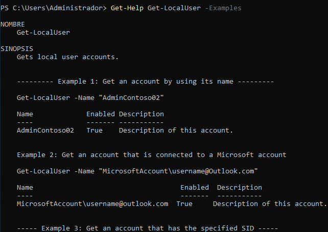

## 2 Obtén un listado de todos los comandos relacionados con la gestión de usuarios locales (es decir, con el nombre LocalUser)
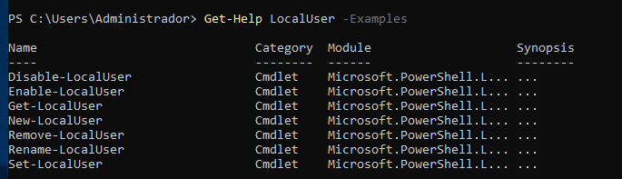

## 3 Utilizando la línea de comandos, muestra en el navegador la ayuda del comando Get-LocalUser.
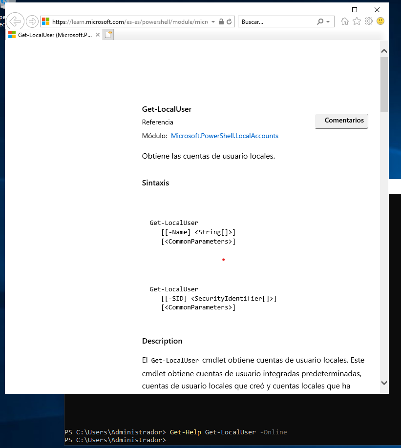

## 4 Averigua para qué sirve el comando Set-Content 
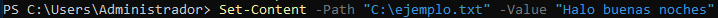

## 5 Explica tres formas diferentes de ver o buscar un comando que hayas utilizado anteriormente en tu sesión.
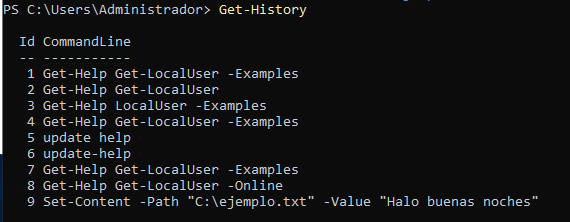
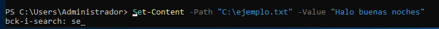
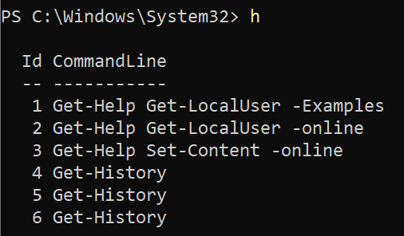

## 6 Averigua si el comando Get-Process tienen un parámetro llamado ComputerName y en caso afirmativo explica para qué sirve.
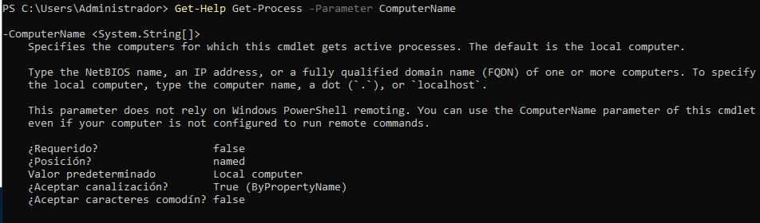

## 7 Muestra la ayuda del comando Start-VM en una ventana emergente.
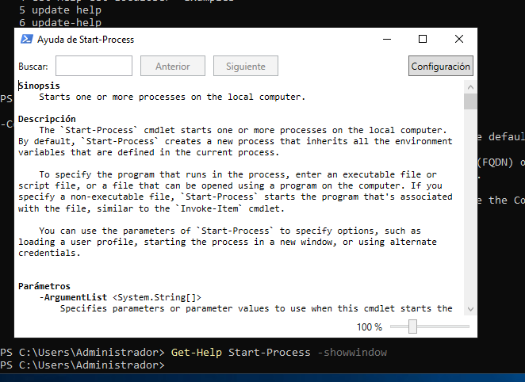

## 8 Muestra la ayuda del comando Get-Help en el navegador invocándolo desde la línea de comandos.
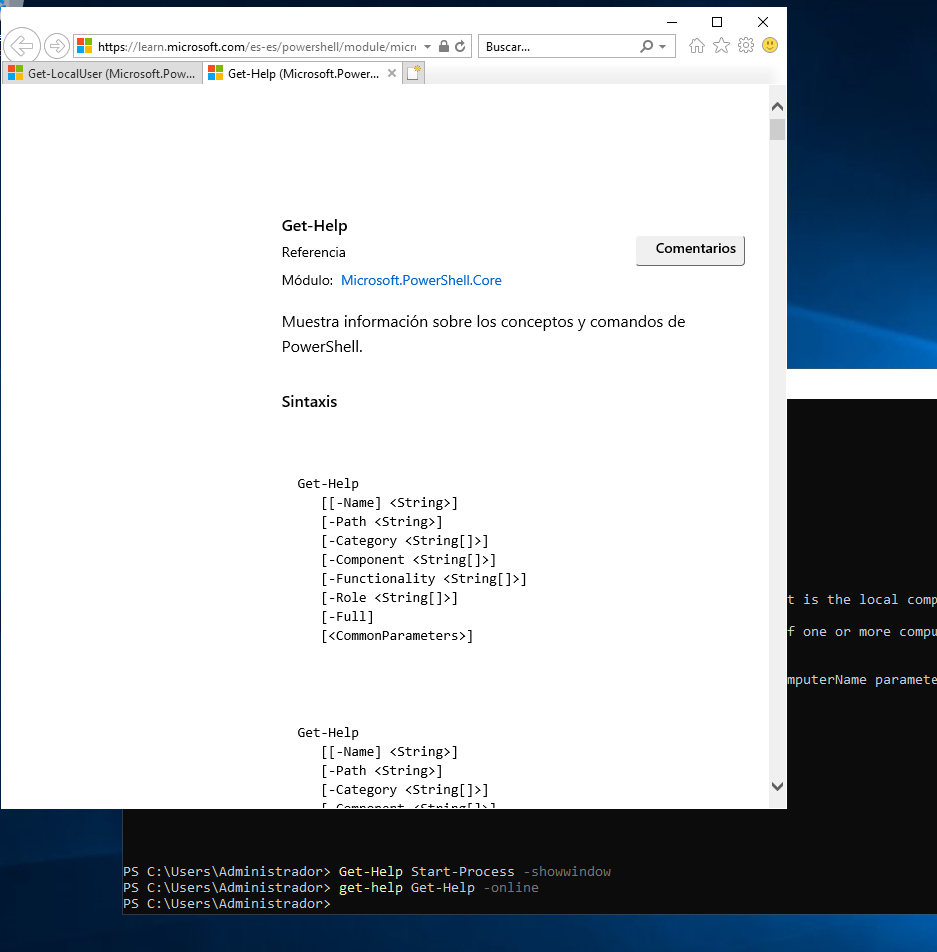

## 9 Muestra las últimas 20 entradas del historial.
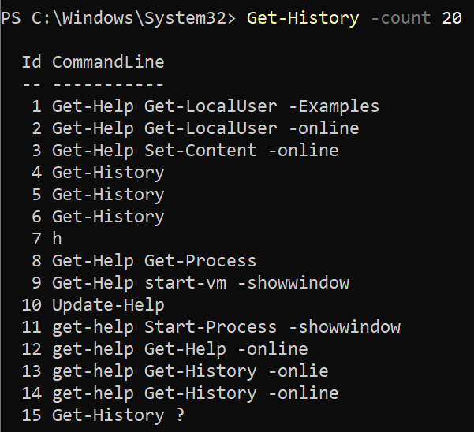

## 10 Elimina las entradas 10, 12 y 14 de tu historial.
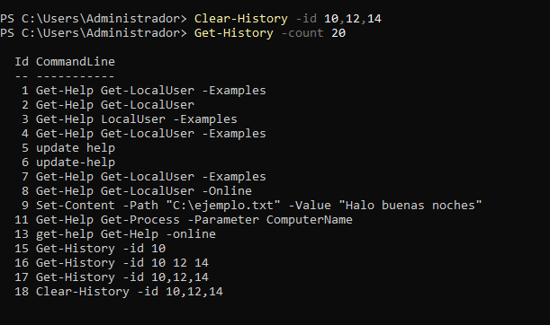

[Volver](../../index.md)