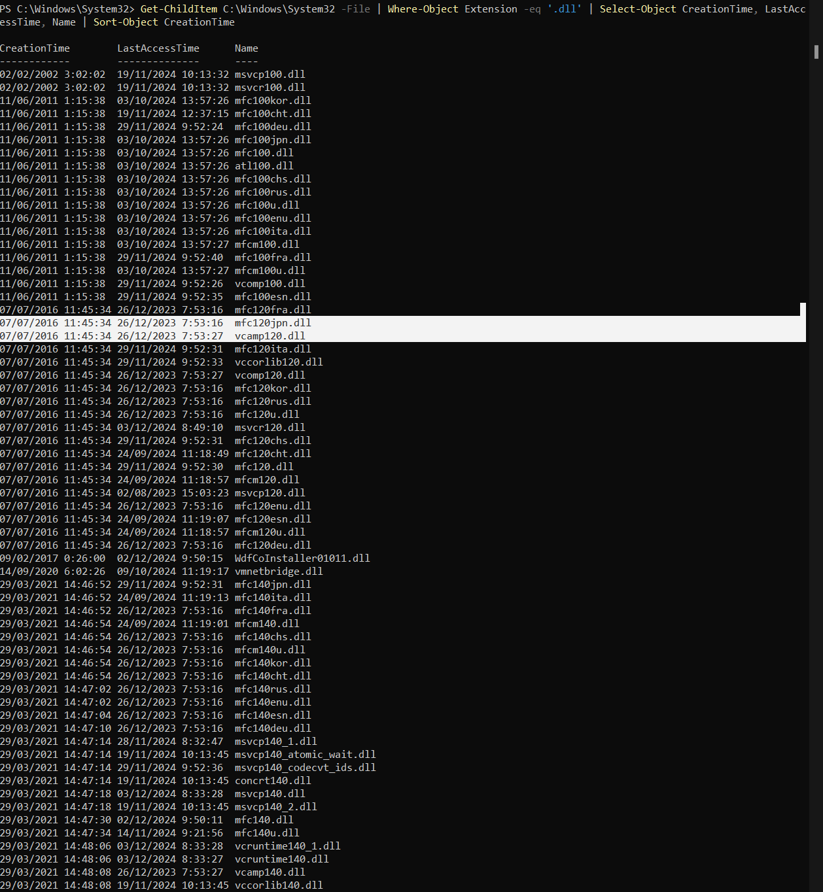

# 1 El comando Get-Date muestra la fecha y hora actual. Muestra por pantalla únicamente el año en que estamos

 
 # 2 Muestra por pantalla, en formato tabla, las propiedades TpmPresent, TpmReady, TpmEnabled y TpmActivated
 

# 3 Muestra por pantalla el número de ficheros y directorios que hay en ese directorio.
 

# 4 Los objetos devueltos por el comando anterior tienen una propiedad denominada Extension, que indica la extensión del archivo. Calcula el número de ficheros en el directorio que tienen la extensión .dll
 

# 5 Muestra los ficheros del directorio con extensión .exe que tengan un tamaño superior a 50000 bytes
 

# 6 Muestra los ficheros de este directorio que tengan extensión .dll, ordenados por fecha de creación y mostrando únicamente las propiedades de fecha de creación (CreationTime), último acceso (LastAccessTime) y nombre (Name)
 

# 7 Muestra el tamaño (Length) y nombre completo (FullName) de todos los ficheros del directorio ordenados por tamaño en sentido descendente
 

# 8 Muestra el tamaño y nombre completo de todos los ficheros del directorio que tengan un tamaño superior a 10MB (10000000 bytes) ordenados por tamaño
 

# 9 Muestra el tamaño y nombre completo de todos los ficheros del directorio que tengan un tamaño superior a 10MB y extensión .exe ordenados por tamaño
 

# 10 Muestra todos los procesos que tienen el estado Responding puesto a False, es decir, todos los procesos del sistema que se hayan colgado
 

# 11 Muestra todos los ficheros de C:\Windows que hayan sido creados con fecha posterior al 15 de octubre de este año
 

[Volver](../../index.md)