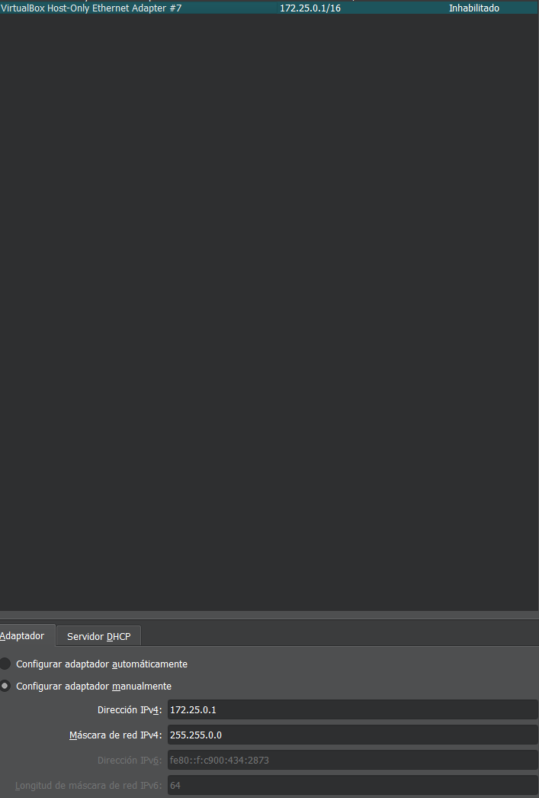
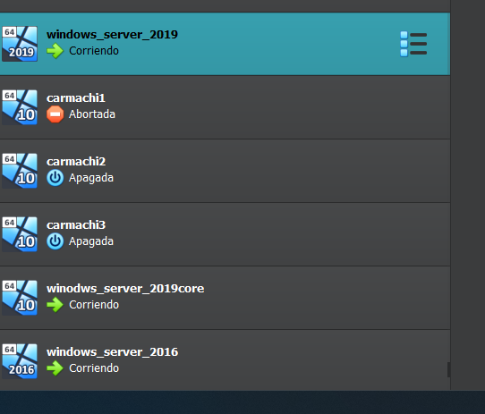
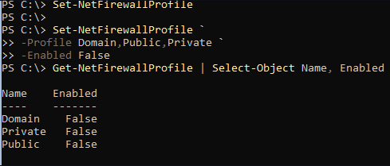
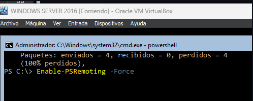
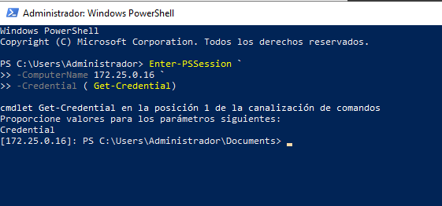

## Vamos a aprovechar la misma red que preparamos el otro día (172.25.0.0/16)

 

## Preparo las 2 maquinas extra 

 

## Desactivo los firewalls y compruebo las conectividades

 

## Realizo los pasos necesarios para activar el psremoting y configuro el archivo trustedhosts

## Configuro  el acceso remoto sobre https y compruebo que me conecta

[Volver](../../index.md)