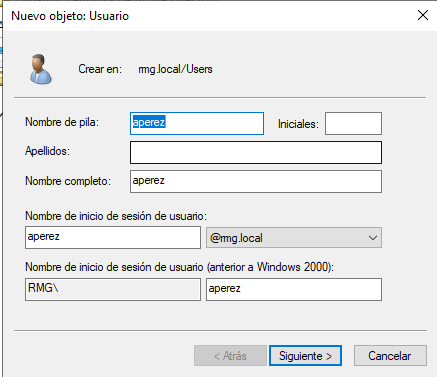
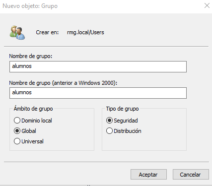
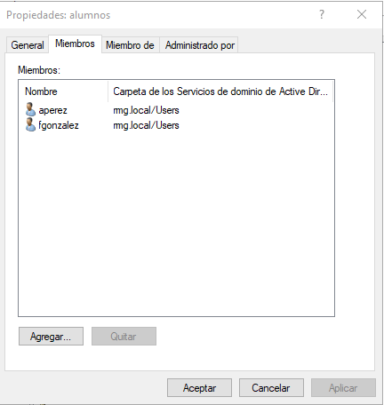
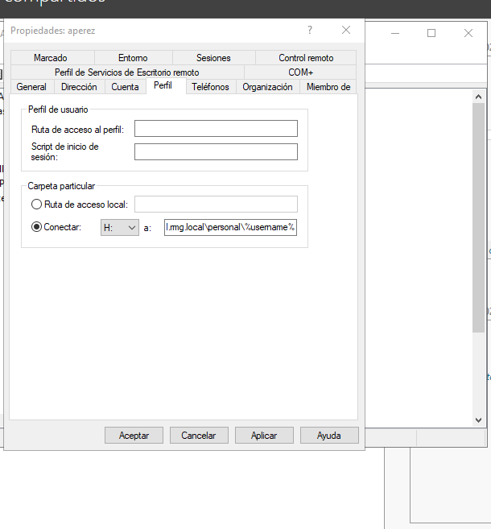
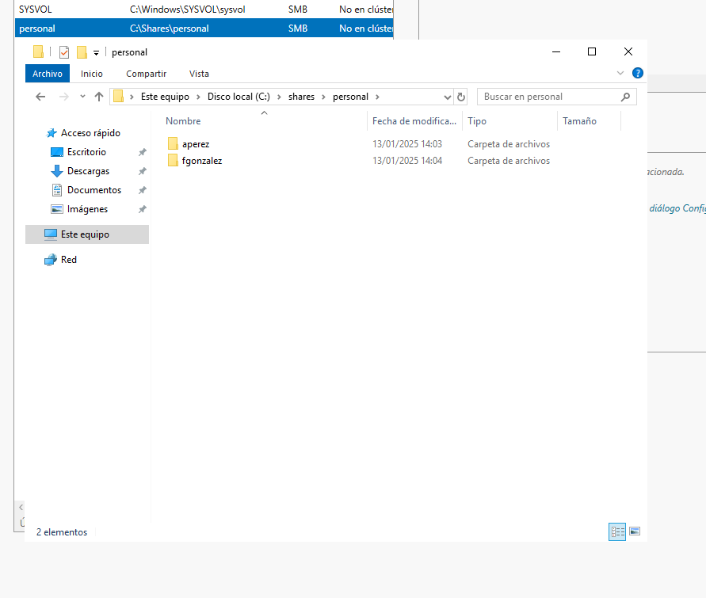

# creacion de usuarios

 
 

## creo el grupo global y meto los usuarios

 
 

## dentro de shares hago las carpetas personales de cada uno con su nombre de usuario

 
 
 

[Volver](../../index.md)